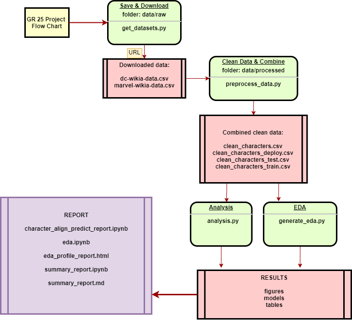

# Workflows_showcase
## Comic Book Character Alignment Predictor
This is Group 25's project for DSCI 522(Data Science Workflows); which is a course in the MDS(Master of Data Science) program at the University of British Columbia.

### Authors

- Aidan Mattrick
- Craig McLaughlin
- Zeliha Ural Merpez
- Ivy Zhang

### Overview

For this project, we will be using data containing [Comic Book Characters](https://github.com/rudeboybert/fivethirtyeight/tree/master/data-raw/comic-characters). The data comes from [Marvel Wikia](https://marvel.fandom.com/wiki/Marvel_Database) and [DC Wikia](https://dc.fandom.com/wiki/DC_Comics_Database). We are interested in the following question:

> 1. Predictive Question: What are the most important features in determining a comic book characters' alignment? 
> 2. Exploratory Question: How are they changing over time?

Alignment target is categorized into three classes from our data set:
- good (hero) 
- bad (villain)
- neutral.

To answer the first predictive question, we tested models such as random forest, decision tree and logistic regression because the majority of the variables are categorical, and they also contain missing values to some extent. The features given in the data set that might correlate with the alignment could be `ID`(this is a categorical variable), `EYE`, `HAIR`, `SEX`, `APPEARANCES`, `publisher` and `year`. 

The plan for answering the second question is to start from scatter-plotting each key variables from analysis above against year to visualize any trend. A regression analysis is a good methodology to interpret the relationship between each variable and `year`. Autocorrelation may be a good factor to look into but as the topic has yet been studied we will temporarily move it to the limitation section for future development.

<!-- #region -->
### Usage and Flowchart
There are two ways to reproduce our analysis:

#### 1. Using `Make`

To replicate the analysis, clone this GitHub repository, install the dependencies given in [environment file](https://github.com/UBC-MDS/Workflows_showcase/blob/main/env/env.yaml), and run the following commands at the command line/terminal from the root directory of this project: 

`
make all
`

to execute work flow analysis, and

`
make clean
`

to remove all the temporary files created by this work flow analysis.


#### 2. Running individual scripts

The datasets can be collected from the source below.

`
python src/get_datasets.py -i https://github.com/rudeboybert/fivethirtyeight/tree/master/data-raw/comic-characters -o data/raw -g -v
`

The row datasets can be processed by using the following command:

`
python src/preprocess_data.py -i data/raw -o data/processed -v
`

To produce the EDA analysis, the generate_eda.py script can be executed by using the following command:

`
python src/generate_eda.py -i data/processed/clean_characters.csv -o results
`

To produce the machine learning analysis results, the analysis.py script can be executed by using the following command:

`
python src/analysis.py -i data/processed/clean_characters_train.csv -o results -v
`

Note: These commands should run without any issues in Git Bash or Terminal. If you are using Windows operating system, you may encounter issues with saving Altair charts. Please refer [altair help](https://altair-viz.github.io/user_guide/saving_charts.html).





### Dependencies

To reproduce, please see dependencies in [environment file](https://github.com/UBC-MDS/Workflows_showcase/blob/main/env/env.yaml).

Python 3.8.5 and Python packages:

* docopt==0.6.2

* pandas==1.1.3

* numpy==1.19.2

* altair==4.1.0

* matplotlib==3.3.3

<!-- #endregion -->

### Data

The data is split into two files, for DC and Marvel, respectively: dc-wikia-data.csv and marvel-wikia-data.csv. Each file has the following variables:

`page_id, name, urlslug, ID, ALIGN, EYE, HAIR, SEX, GSM, ALIVE, APPEARANCES, FIRST APPEARANCE, YEAR`

The desciptions for the variables can be found [here](https://github.com/UBC-MDS/Workflows_showcase/blob/main/report/summary_report.ipynb)


For a detailed summary regarding our source data, please read [eda_profile_report.html](https://github.com/UBC-MDS/Workflows_showcase/blob/main/report/eda_profile_report.html). For a more visual overview of the dataset, charts have been built using Altair package, which can be obtained by running `src/generate_eda.py`.

The `clean_characters.csv` file contains observations with null alignments. Within preprocess, we have seperated characters with null alignment into deployment set, and split remaining dataset into train and test data. In analysis, by using the cross-validation on train set and decided which models would predict better to answer our question. More details can be found [here](https://github.com/UBC-MDS/Workflows_showcase/blob/main/report/summary_report.ipynb).


We have done explanatory analysis on the combined data frame named `clean_characters.csv`. The overview tables for dataset and features are obtained by `src/generate_eda.py`. For a detailed summary regarding our source data, please read [eda_profile_report.html](https://github.com/UBC-MDS/Workflows_showcase/blob/main/report/eda_profile_report.html). For a more visual overview of the dataset, charts have been built using Altair package, which can be obtained by running `src/generate_eda.py`. The visual overview can also be found in [figures and tables](https://github.com/UBC-MDS/Workflows_showcase/tree/main/results) directory, or generated by the command lines given below. The written report can be found here [jupyter file](https://github.com/UBC-MDS/Workflows_showcase/blob/main/report/eda.ipynb).

### Report
The final report can be found [here](https://github.com/UBC-MDS/Workflows_showcase/blob/main/report/summary_report.ipynb).

### Releases

[Milestone 1: 0.0.1](https://github.com/UBC-MDS/Workflows_showcase/releases/tag/0.0.1)

[Milestone 2: 0.1.0]


### References

1. [Comic Book Characters](https://github.com/rudeboybert/fivethirtyeight/tree/master/data-raw/comic-characters) 
<!-- #endregion -->

2. [Sample Group Project](https://github.com/ttimbers/breast_cancer_predictor)

2. [Render Table Sample](https://stackoverflow.com/questions/19726663/how-to-save-the-pandas-dataframe-series-data-as-a-figure)

```python

```
