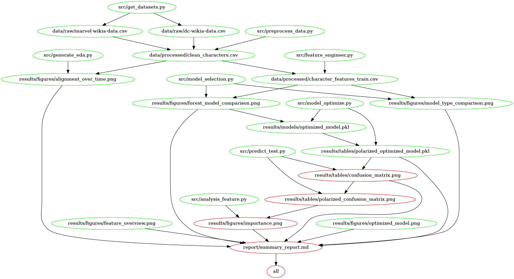

# Workflows_showcase
## Comic Book Character Alignment Predictor
This is Group 25's project for DSCI 522(Data Science Workflows); which is a course in the MDS(Master of Data Science) program at the University of British Columbia.

### Authors

- Aidan Mattrick
- Craig McLaughlin
- Zeliha Ural Merpez
- Ivy Zhang

### Overview

For this project, we will be using data containing [Comic Book Characters](https://github.com/rudeboybert/fivethirtyeight/tree/master/data-raw/comic-characters). The data comes from [Marvel Wikia](https://marvel.fandom.com/wiki/Marvel_Database) and [DC Wikia](https://dc.fandom.com/wiki/DC_Comics_Database). We are interested in the following question:

> Predictive Question: What are the most important features in determining a comic book characters' alignment? 

Alignment target is categorized into three classes from our data set:
- good (hero) 
- bad (villain)
- neutral.

To answer the first predictive question, we tested models such as random forest, decision tree and logistic regression because the majority of the variables are categorical, and they also contain missing values to some extent. The features given in the data set that might correlate with the alignment could be `ID`(this is a categorical variable), `EYE`, `HAIR`, `SEX`, `APPEARANCES`, `publisher` and `year`. 

<!-- #region -->

### Report
The final html report can be found [here](https://github.com/UBC-MDS/Workflows_showcase/blob/main/report/summary_report.ipynb).

### Usage and Flowchart
There are three ways to reproduce our analysis:

#### 1. Using Docker

To replicate the analysis, clone this GitHub repository, and install the docker by running the following commands at the command line/terminal from the root directory of this project.

```
docker run --rm -v <LOCAL PATH TO REPO>:/home cmmclaug/dsci522_workflows_showcase:0.0.1 make -C /home all
```

To remove all the temporary files created by this work flow analysis, you can run the following commands at the command line/terminal from the root directory of this project:

```
docker run --rm -v <LOCAL PATH TO REPO>:/home cmmclaug/dsci522_workflows_showcase:0.0.1 make -C /home clean
```

#### 2. Using `Make`

To replicate the analysis, clone this GitHub repository, install the dependencies given in [environment file](https://github.com/UBC-MDS/Workflows_showcase/blob/main/env/env.yaml), and run the following commands at the command line/terminal from the root directory of this project: 

```
make all
```

to execute work flow analysis, and

```
make clean
```

to remove all the temporary files created by this work flow analysis.


#### 3. Running Individual Scripts

The datasets can be collected from the source below.

```
python src/get_datasets.py -i https://github.com/rudeboybert/fivethirtyeight/tree/master/data-raw/comic-characters -o data/raw -g -v
```

The raw datasets can be processed by using the following command:

```
python src/preprocess_data.py -i data/raw -o data/processed/clean_characters.csv -v
```

To produce the EDA analysis, the generate_eda.py script can be executed by using the following command:

```
python src/generate_eda.py -i data/processed/clean_characters.csv -o results
```

To produce the model selection analysis results on full alignment data, the model_selection.py script can be executed by using the following command:

```
python src/model_selection.py -i data/processed/clean_characters_train.csv -o results -v
```

To produce the model selection analysis results on only polarized good-bad alignment characters, the model_selection.py script can be executed by using the following command:

```
python src/model_selection.py -i data/processed/character_features_polar_train.csv -o results -v
```

To produce the model optimization analysis results on full alignment data, the model_selection.py script can be executed by using the following command:

```
python src/model_optimize.py -i data/processed/character_features_train.csv -o results -v
```

To produce the optimized model analysis results on only polarized good-bad alignment characters, the predict_test.py script can be executed by using the following command:

```
python src/predict_test.py -i data/processed/character_features_polar_train.csv -o results -v
```

To tet the optimized model on the test set of all alignment characters, the predict_test.py script can be executed by using the following command:

```
python src/predict_test.py -i data/processed/character_features_polar_train.csv -m results/models/optimized_model.pkl -v
```

To tet the optimized model on the test set of polarized alignment characters, the predict_test.py script can be executed by using the following command:

```
python src/predict_test.py -i data/processed/character_features_polarized_test.csv -m results/models/polarized_optimized_model.pkl -f polarized_ -v
```


To produce seperate feature importances. the analysis_feature.py script can be executed by using the following command: 

```
python src/analysis_feature.py -i results/models/optimized_model.pkl -j data/processed/character_features_train.csv -o results
```


### Makefile Dependency



### Dependencies

To reproduce, please see dependencies in [environment file](https://github.com/UBC-MDS/Workflows_showcase/blob/main/env/env.yaml).
You also need to install the package below to save the `png` images:
```
npm install -g vega-lite vega-cli canvas --force
```


Note: These commands should run without any issues in Git Bash or Terminal. Please refer [altair help](https://altair-viz.github.io/user_guide/saving_charts.html).

For problems in saving Altair charts, on Linux systems run code `apt-get install chromium-chromedriver` in Git Bash or Terminal.

<!-- #endregion -->

### Data

The data is split into two files, for DC and Marvel, respectively: dc-wikia-data.csv and marvel-wikia-data.csv. Each file has the following variables:

`page_id, name, urlslug, ID, ALIGN, EYE, HAIR, SEX, GSM, ALIVE, APPEARANCES, FIRST APPEARANCE, YEAR`

The desciptions for the variables can be found [here](https://github.com/UBC-MDS/Workflows_showcase/blob/main/report/summary_report.ipynb)


For a detailed summary regarding our source data, please read [eda.ipynb](https://github.com/UBC-MDS/Workflows_showcase/blob/main/report/eda.ipynb). For a more visual overview of the dataset, charts have been built using Altair package, which can be obtained by running `src/generate_eda.py`.

The `clean_characters.csv` file contains observations with null alignments. Within feature_engineer.py, we have added 4 new columns using the `Name` column in original dataset, then separated characters with null alignment into deployment set, and split remaining dataset into train and test data. For details refer to the feature engineering section in [summary_report](https://github.com/UBC-MDS/Workflows_showcase/blob/main/report/summary_report.ipynb).  We have done explanatory analysis on the combined data frame named `clean_characters.csv`. The overview tables for dataset and features are obtained by `src/generate_eda.py`. For a detailed summary regarding our source data, please read [eda_profile_report.html](https://github.com/UBC-MDS/Workflows_showcase/blob/main/report/eda_profile_report.html). For a more visual overview of the dataset, charts have been built using Altair package, which can be obtained by running `src/generate_eda.py`. The visual overview can also be found in [figures and tables](https://github.com/UBC-MDS/Workflows_showcase/tree/main/results) directory, or generated by the command lines given below. The written report can be found here [jupyter file](https://github.com/UBC-MDS/Workflows_showcase/blob/main/report/eda.ipynb).

In analysis, by using the cross-validation on train set and decided which models would predict better to answer our question. First we have tried the following models:
- Dummy Classifier (as baseline)
- Decision Tree Classifier
- Random Forest Classifier
- SVM
- OVR Logistic Regression
- Logistic Regression.

The best validation accuracy is obtained by Random Forest Classifier, so further analysis is done to get Forest model comparison between Random Forest Classifier, LGBM Classifier and Cat Boost Classifier. After that hyperparameter optimization is done with model LGBM Classifier to get the best scoring model. Using the best model resulting in analysis.py, we obtained the feature importance table used in tree splits. More details can be found [here](https://github.com/UBC-MDS/Workflows_showcase/blob/main/report/summary_report.ipynb).

### Releases

[Milestone 1: 0.0.1](https://github.com/UBC-MDS/Workflows_showcase/releases/tag/0.0.1)

[Milestone 2: 0.1.0](https://github.com/UBC-MDS/Workflows_showcase/releases/tag/0.1.0)

[Milestone 3: 0.2.0](https://github.com/UBC-MDS/Workflows_showcase/releases/tag/0.2.0)

[Milestone 4: 0.4.0](https://github.com/UBC-MDS/Workflows_showcase/releases/tag/0.4.0)


### References

1. [Comic Book Characters](https://github.com/rudeboybert/fivethirtyeight/tree/master/data-raw/comic-characters) 
<!-- #endregion -->

2. [Sample Group Project](https://github.com/ttimbers/breast_cancer_predictor)

3. [Render Table Sample](https://stackoverflow.com/questions/19726663/how-to-save-the-pandas-dataframe-series-data-as-a-figure)

4. [Name Census: United States Demographic Data](https://namecensus.com)

```python

```
