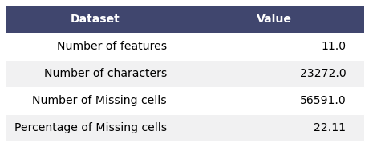
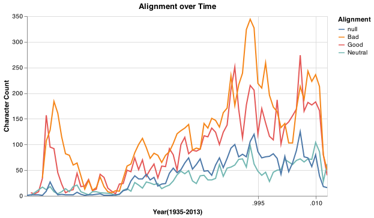
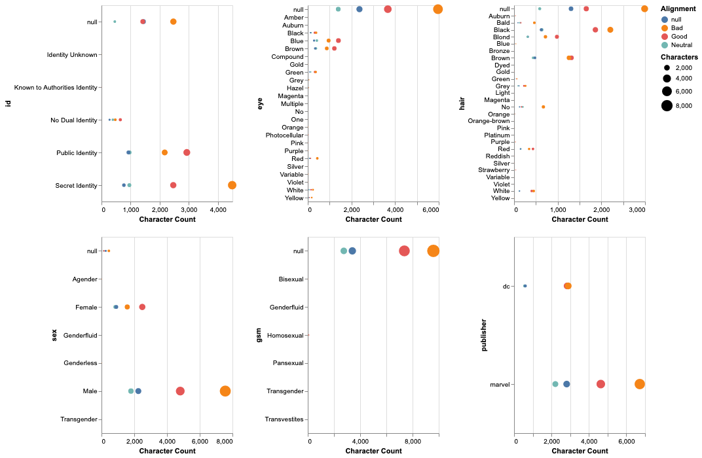
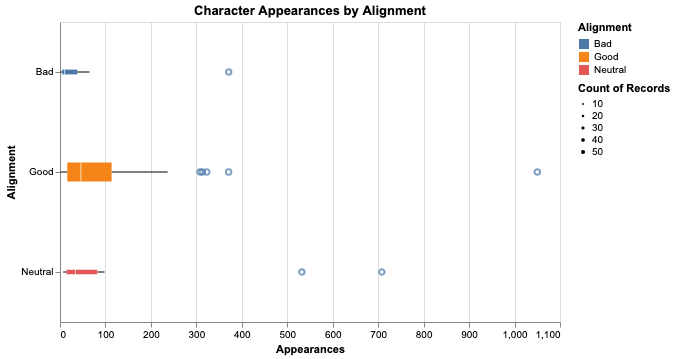

```python
import pickle
import sys
sys.path.insert(1, '../src')
from render_table import render_table

dataset_overview_df = pickle.load(open("../results/tables/dataset_overview.pkl", "rb"))
feature_overview_df = pickle.load(open("../results/tables/feature_overview.pkl", "rb"))

render_table(dataset_overview_df, header_columns=0, col_width=4)
dataset_overview_df
```


<div>
<style scoped>
    .dataframe tbody tr th:only-of-type {
        vertical-align: middle;
    }

    .dataframe tbody tr th {
        vertical-align: top;
    }

    .dataframe thead th {
        text-align: right;
    }
</style>
<table border="1" class="dataframe">
  <thead>
    <tr style="text-align: right;">
      <th></th>
      <th>Dataset</th>
      <th>Value</th>
    </tr>
  </thead>
  <tbody>
    <tr>
      <th>0</th>
      <td>Number of features</td>
      <td>11.00</td>
    </tr>
    <tr>
      <th>1</th>
      <td>Number of characters</td>
      <td>23272.00</td>
    </tr>
    <tr>
      <th>2</th>
      <td>Number of Missing cells</td>
      <td>56591.00</td>
    </tr>
    <tr>
      <th>3</th>
      <td>Percentage of Missing cells</td>
      <td>22.11</td>
    </tr>
  </tbody>
</table>
</div>


    

    







```python

```
